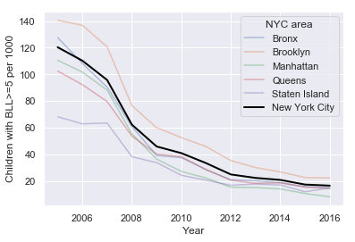
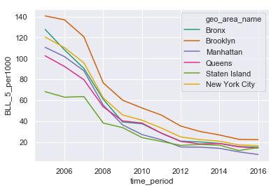

# Exploratory Data Analysis in Python
### The Dangers of Lead Exposure
Children exposed to any level of lead may face serious, irreversible harm that has consequences throughout their lifetimes. Children under the age of six are at greatest risk for exposure because they explore the world through hand-to-mouth activity and because their bodies are rapidly growing and can more readily absorb lead.  Elevated blood lead levels in children can result in behavioral changes, reduced educational attainment and hearing and speech delays.

In New York City, children are required to be tested for lead poisoning at around age 1 and age 2, and to be screened for risk of lead poisoning, and tested if at risk, up until age 6. NYC through the Department of Health and Mental Hygiene publishes open-source yearly data on lead levels in children under 6 years of age. These data are an indicator of children younger that 6 years of age tested in NYC in a given year with blood lead levels of 5 mcg/dL or greater, a threshold reference level set by the CDC.

### Goal
To check trends in children with elevated Blood Lead Levels (BLL) overtime in different neighborhoods of NYC, and find out NYC neighborhoods having high proportions of children with elevated BLL.

### Brief description of the data analysis
Original data was downloaded as a CSV file from NYC OpenData website:  
https://data.cityofnewyork.us/Health/Children-Under-6-yrs-with-Elevated-Blood-Lead-Leve/tnry-kwh5

Here is a brief description of what I did with the data:
1. Created a Jupyter Notebook and read the csv file into a dataframe.
2. Removed unnecessary columns from the dataframe and renamed a few of those.
3. Explored data in a few columns by using Pandas value_counts() function.
4. Using matplotlib and Seaborn libraries, generated side-by-side line plots of children with BLL>=5, BLL>=10 and BLL>=15, for each NYC borough and all of NYC.
5. Since Brooklyn showed the hightest BLL cases, generated line plots for different neighborhoods in Brooklyn and found that Greenpoint neighborhood in Brookyn had the most cases of high BLL in children.
6. My findings matched well with the stories published in the media:  
https://blogs.ei.columbia.edu/2017/10/09/many-backyards-in-brooklyn-neighborhood-are-contaminated-with-high-levels-of-lead/  
https://www1.nyc.gov/assets/doh/downloads/pdf/lead/lead-2012report.pdf

### Jupyter notebook and the plots

```python
# Author: Ved P Sharma
# Date: 02/23/2020

import numpy as np # linear algebra
import pandas as pd # data processing, CSV file I/O (e.g. pd.read_csv)
import matplotlib.pyplot as plt
import seaborn as sns
sns.set()
```


```python
# Importing csv files and cleaning data by deleting unwanted columns and deleting rows with N/A values
folderName = 'd:/Users/ved/Data Science/NYC_BLL/'
fileName = 'NYC_Children_under_6_BLL.csv'

df = pd.read_csv(folderName+fileName)
#df
```


```python
df = df.iloc[:, :19]
```


```python
#df
```


```python
old_colnames = df.columns.tolist()
new_colnames = old_colnames[:5] + ['BLL_5', 'BLL_5_notes', 'BLL_10', 'BLL_10_notes', 'BLL_15', 'BLL_15_notes', 
                                   'Tested', 'Tested_notes', 'BLL_5_per1000', 'BLL_5_per1000_notes', 
                                   'BLL_10_per1000', 'BLL_10_per1000_notes', 'BLL_15_per1000', 'BLL_15_per1000_notes']
print(new_colnames)
len(new_colnames)
```

    ['geo_type', 'geo_area_id', 'geo_area_name', 'borough_id', 'time_period', 'BLL_5', 'BLL_5_notes', 'BLL_10', 'BLL_10_notes', 'BLL_15', 'BLL_15_notes', 'Tested', 'Tested_notes', 'BLL_5_per1000', 'BLL_5_per1000_notes', 'BLL_10_per1000', 'BLL_10_per1000_notes', 'BLL_15_per1000', 'BLL_15_per1000_notes']
    


    19


```python
df.columns = new_colnames
#df
```


```python
df['geo_type'].value_counts()
```


    Neighborhood (UHF 42)    504
    Borough                   60
    Citywide                  12
    Name: geo_type, dtype: int64


```python
df['geo_area_name'].value_counts()
#df['geo_area_name'].unique()
```


    East Harlem                             12
    Union Square - Lower East Side          12
    Staten Island                           12
    Sunset Park                             12
    Jamaica                                 12
    Canarsie - Flatlands                    12
    Rockaways                               12
    Brooklyn                                12
    Bronx                                   12
    Flushing - Clearview                    12
    Greenwich Village - SoHo                12
    New York City                           12
    Washington Heights                      12
    East Flatbush - Flatbush                12
    Bensonhurst - Bay Ridge                 12
    Port Richmond                           12
    Upper West Side                         12
    Downtown - Heights - Slope              12
    Hunts Point - Mott Haven                12
    Williamsburg - Bushwick                 12
    Greenpoint                              12
    Queens                                  12
    Manhattan                               12
    Kingsbridge - Riverdale                 12
    Southeast Queens                        12
    Northeast Bronx                         12
    Upper East Side                         12
    Fordham - Bronx Pk                      12
    High Bridge - Morrisania                12
    East New York                           12
    West Queens                             12
    Gramercy Park - Murray Hill             12
    Pelham - Throgs Neck                    12
    Ridgewood - Forest Hills                12
    Borough Park                            12
    Long Island City - Astoria              12
    Stapleton - St. George                  12
    Coney Island - Sheepshead Bay           12
    Southwest Queens                        12
    Chelsea - Clinton                       12
    Fresh Meadows                           12
    Lower Manhattan                         12
    Willowbrook                             12
    Central Harlem - Morningside Heights    12
    Bedford Stuyvesant - Crown Heights      12
    Bayside - Little Neck                   12
    Crotona -Tremont                        12
    South Beach - Tottenville               12
    Name: geo_area_name, dtype: int64


```python
df['time_period'].value_counts()
```


    2016    48
    2015    48
    2014    48
    2013    48
    2012    48
    2011    48
    2010    48
    2009    48
    2008    48
    2007    48
    2006    48
    2005    48
    Name: time_period, dtype: int64


```python
df['borough_id'].value_counts()
```


    2.0    144
    4.0    132
    3.0    132
    1.0     96
    5.0     60
    Name: borough_id, dtype: int64


```python
fig, axes = plt.subplots(1,3,figsize=(20,6))
colors = ['red', "green", "blue", "DARKTURQUOISE", 'deeppink', "black"]
#sns.set_palette('husl')
all_areas = ['Bronx', 'Brooklyn', 'Manhattan', 'Queens', 'Staten Island', 'New York City']
with sns.color_palette(colors):
    sns.lineplot(x='time_period', y='BLL_5_per1000', data=df[df['geo_area_name'].isin(all_areas)], hue='geo_area_name', ax=axes[0])
    sns.lineplot(x='time_period', y='BLL_10_per1000', data=df[df['geo_area_name'].isin(all_areas)], hue='geo_area_name', ax=axes[1])
    sns.lineplot(x='time_period', y='BLL_15_per1000', data=df[df['geo_area_name'].isin(all_areas)], hue='geo_area_name', ax=axes[2])
#fig.tight_layout()
```


```python
#demostration of highlighting a group among many and setting custom x, y labels and legend
sns.lineplot(x='time_period', y='BLL_5_per1000', data=df[df['geo_area_name'].isin(['Bronx'])], alpha=0.4)
sns.lineplot(x='time_period', y='BLL_5_per1000', data=df[df['geo_area_name'].isin(['Brooklyn'])], alpha=0.4)
sns.lineplot(x='time_period', y='BLL_5_per1000', data=df[df['geo_area_name'].isin(['Manhattan'])], alpha=0.4)
sns.lineplot(x='time_period', y='BLL_5_per1000', data=df[df['geo_area_name'].isin(['Queens'])], alpha=0.4)
sns.lineplot(x='time_period', y='BLL_5_per1000', data=df[df['geo_area_name'].isin(['Staten Island'])], alpha=0.4)
sns.lineplot(x='time_period', y='BLL_5_per1000', data=df[df['geo_area_name'].isin(['New York City'])], linewidth=2, color='black', linestyle='dashed')
plt.xlabel('Year'); plt.ylabel('Children with BLL>=5 per 1000');
plt.legend(title='NYC area', labels=all_areas);
```





```python
# plot for brooklyn neighborhoods
# subset to all Brooklyn areas
df2 = df[(df['borough_id']==2) & (df['geo_area_name']!='Brooklyn')]
fig, axes = plt.subplots(1,3,figsize=(20, 6))
sns.lineplot(x='time_period', y='BLL_5_per1000', data=df2, hue='geo_area_name', ax=axes[0], legend=None)
sns.lineplot(x='time_period', y='BLL_10_per1000', data=df2, hue='geo_area_name', ax=axes[1], legend=None)
sns.lineplot(x='time_period', y='BLL_15_per1000', data=df2, hue='geo_area_name', ax=axes[2])
plt.legend(bbox_to_anchor=(1.04,1), loc='upper left', title='Brooklyn area', labels=df2['geo_area_name'].unique());
```


```python
# trying a different color palette
with sns.color_palette('Dark2'):
    sns.lineplot(x='time_period', y='BLL_5_per1000', data=df[df['geo_area_name'].isin(all_areas)], hue='geo_area_name')
```





```python

```
### Takeaways
The percentage of children with elevated BLL in NYC has dramtically come down over the years (2005-2016) in all boroughs of NYC. Brooklyn consistently showed the hightest BLL cases in children under the age of 6 years. In particular, Greenpoint neighborhood of Brookyn had the most cases of high BLL in children. Interestingly, my findings were corroborated by articles published in the media:  

https://blogs.ei.columbia.edu/2017/10/09/many-backyards-in-brooklyn-neighborhood-are-contaminated-with-high-levels-of-lead/  

https://www1.nyc.gov/assets/doh/downloads/pdf/lead/lead-2012report.pdf
